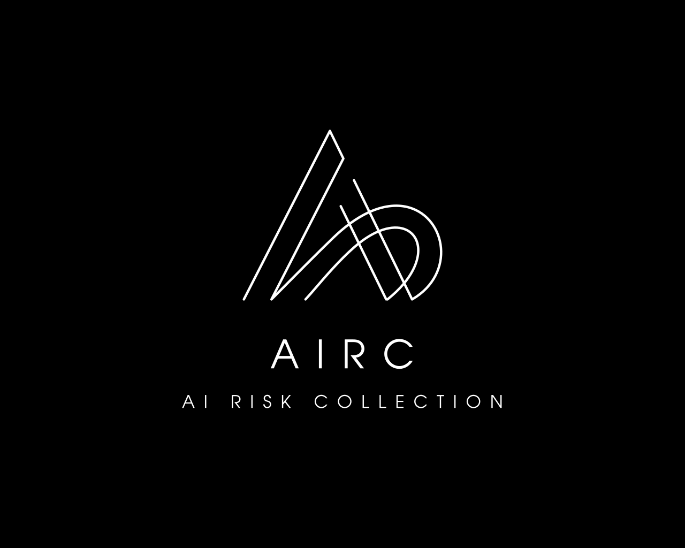

### **AI Risk Collection (AIRC)**

**Objective:**  
AIRC is dedicated to collecting, curating, and categorizing real-world examples of AI risks that emerge during research and deployment. The project aims to serve as a knowledge base to inform AI safety research, policy, and best practices, while facilitating the development of AI risk mitigation strategies.

### **Key Goals:**
1. **Data Collection & Curation:** Identify and collect detailed AI risk examples from real-world applications across diverse sectors (e.g., healthcare, finance, autonomous systems).
2. **Risk Categorization:** Systematically categorize risks based on the nature of failure, harm, or unintended outcomes.
3. **Risk Prediction & Prevention:** Create a repository of case studies that can help developers and regulators foresee potential risks during AI system development and deployment.
4. **Community Collaboration:** Encourage contributions from researchers, engineers, policymakers, and stakeholders for a robust, multi-disciplinary understanding of AI risks.
5. **Practical Solutions & Best Practices:** Develop guidelines for the safe deployment of AI systems, addressing specific risks based on collected examples.

### **Architecture:**

1. **Data Collection and Ingestion:**
   - **Sources of Data:** Open-source research, industry case studies, user-generated reports, academic papers, and regulatory bodies.
   - **Automated Ingestion Pipelines:** Utilize NLP models to scrape relevant information from papers, reports, and media mentions related to AI risks.
   - **Crowdsourced Reporting Mechanism:** A platform that allows industry experts and users to submit risk cases, ensuring anonymity and structured data submission for consistency.

2. **Risk Categorization Engine:**
   - **Taxonomy of Risks:** Define and categorize risks into types, including:
     - Algorithmic bias
     - Model failure or degradation
     - Unsafe autonomy
     - Vulnerability to adversarial attacks
     - Unintended social, economic, or ethical consequences
   - **Severity Levels:** Assign severity scores based on potential or actual harm (e.g., minor, moderate, critical).
   - **Sector-Specific Risks:** Tailor taxonomies to specific domains such as healthcare, transportation, finance, defense, etc.

3. **Case Study Repository:**
   - **Searchable Database:** Make the collection of risk examples accessible through a structured database, allowing users to search by risk type, severity, domain, and mitigation strategies.
   - **Versioned Risk Examples:** Maintain a history of how a particular risk evolved or was mitigated over time (especially useful for AI systems that update frequently).
   - **User Feedback Loop:** Include feedback mechanisms where users can rate the quality of risk examples or suggest additional details and references.

4. **Risk Analytics Dashboard:**
   - **Visual Insights:** Provide dashboards to visualize AI risk trends across sectors, highlighting common patterns, emerging risks, and historical data.
   - **Heatmaps & Risk Scores:** Show a heatmap of common risk hotspots by sector or AI model type.
   - **Mitigation Tracking:** Visualize how mitigation strategies have affected risk profiles over time.

5. **Community Collaboration & Incentives:**
   - **Open Contributions:** Allow researchers and developers to contribute AI risk examples and suggested mitigations.
   - **Research Partnerships:** Collaborate with research institutions, AI companies, and regulators to validate and expand the dataset.
   - **Incentives for Contributions:** Offer recognition or rewards (e.g., citations, co-authorship) for valuable contributions.

6. **Publication & Knowledge Sharing:**
   - **Annual Report:** Publish yearly reports summarizing key findings, trends, and recommendations for policymakers and industry players.
   - **Workshops & Conferences:** Host events to discuss new AI risks, present case studies, and share research findings.
   - **API for Risk Data:** Offer an API to integrate the risk collection into AI development platforms, enabling developers to query risk examples as they design systems.

---

### **Concrete Examples of AI Risks for AIRC:**

1. **Example 1: Bias in Predictive Policing Algorithms**
   - **Sector:** Law Enforcement
   - **Risk Type:** Algorithmic Bias
   - **Description:** Predictive policing tools were found to disproportionately target minority communities due to biased training data, leading to over-policing in certain neighborhoods.
   - **Impact:** Legal ramifications, social unrest, and loss of trust in law enforcement.
   - **Mitigation Strategy:** Implement fairness auditing and retraining on more diverse datasets; ongoing community oversight.

2. **Example 2: Adversarial Attack on Autonomous Vehicles**
   - **Sector:** Transportation
   - **Risk Type:** Vulnerability to Adversarial Attacks
   - **Description:** An autonomous vehicle was fooled by small perturbations to street signs, causing it to misread a stop sign as a yield sign.
   - **Impact:** Increased risk of accidents and safety failures.
   - **Mitigation Strategy:** Strengthen adversarial defense mechanisms by regularly testing models against adversarial examples.

3. **Example 3: Financial Algorithm Flash Crash**
   - **Sector:** Finance
   - **Risk Type:** Model Degradation
   - **Description:** A high-frequency trading algorithm malfunctioned due to unexpected market conditions, leading to a flash crash and wiping out billions of dollars in value within minutes.
   - **Impact:** Economic instability and regulatory concerns.
   - **Mitigation Strategy:** Real-time monitoring and back-testing of AI models under simulated extreme market conditions.

4. **Example 4: Misdiagnosis in AI-based Healthcare Diagnostics**
   - **Sector:** Healthcare
   - **Risk Type:** Model Failure
   - **Description:** An AI diagnostic tool incorrectly identified benign tumors as malignant due to a flawed training dataset.
   - **Impact:** Patient harm and loss of trust in AI-based medical tools.
   - **Mitigation Strategy:** Use a multi-layered verification system, combining AI suggestions with human expertise, and maintain diverse and comprehensive training data.

5. **Example 5: AI Misinformation Propagation**
   - **Sector:** Media & Social Platforms
   - **Risk Type:** Unintended Social Consequences
   - **Description:** An AI model for content recommendation on a social media platform amplified misinformation, contributing to societal polarization.
   - **Impact:** Harmful social division, disinformation, and ethical concerns.
   - **Mitigation Strategy:** Introduce human moderation and implement content verification tools to reduce the spread of false information.

---

